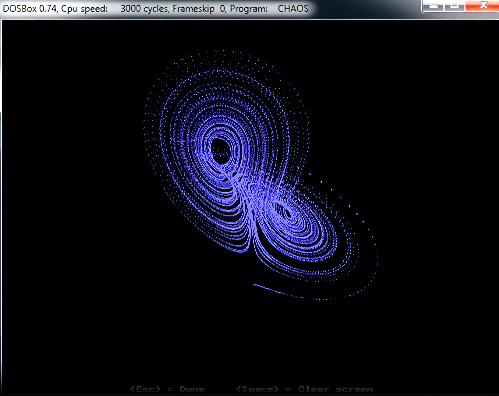
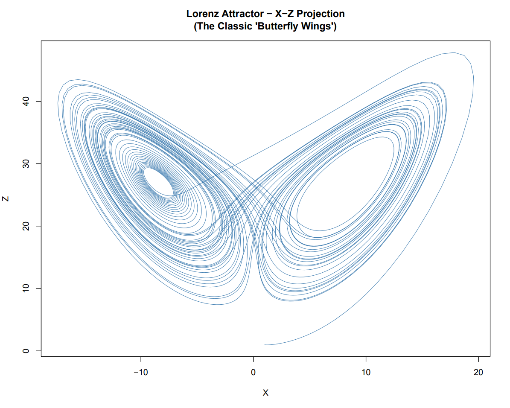
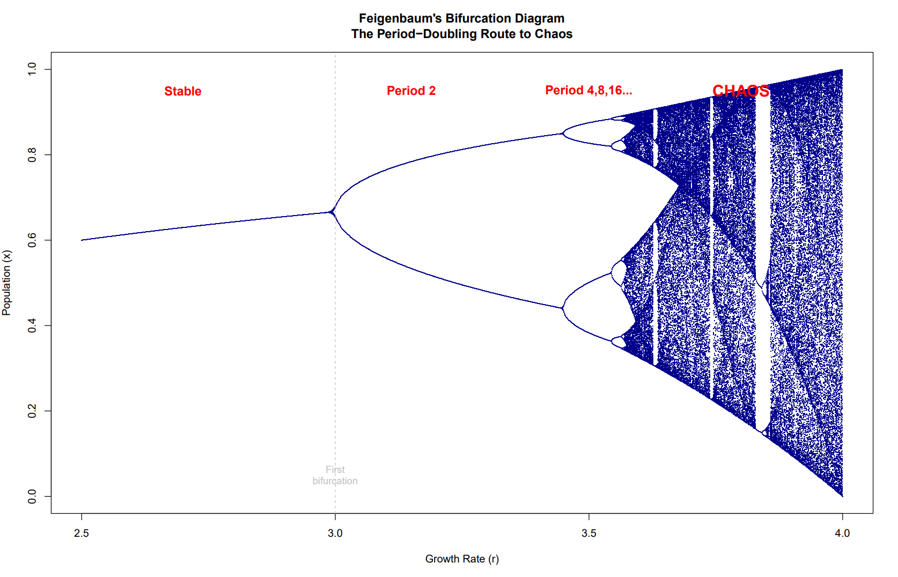
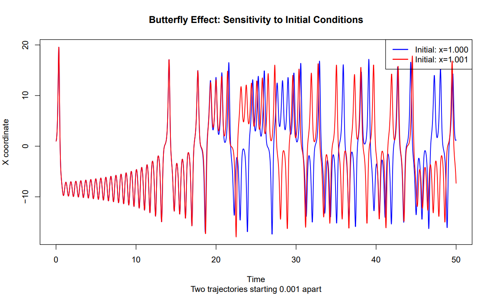

# Chaos Theory Models 🦋

[](https://opensource.org/licenses/MIT)
[](https://www.r-project.org/)
[]()
[]()

> **Mathematical models from James Gleick's "Chaos: Making a New Science"**  
> Modern R implementations of the Lorenz attractor, logistic map bifurcations, and Feigenbaum universality—going beyond DOSBox to create publication-quality visualizations with applications to cognitive science.

---

## 📋 Project Overview

This repository contains implementations of foundational chaos theory models extracted from James Gleick's seminal 1987 book. Created for a computational modeling class, this project demonstrates:

- ✨ **The Butterfly Effect** through Lorenz's three-equation weather model
- 📊 **Period-doubling cascades** via the logistic map
- 🔢 **Universal constants** (Feigenbaum's δ ≈ 4.669) appearing across different systems
- 🧠 **Applications to psychology** including automaticity, decision-making, and behavioral dynamics

### 🎯 Project Goals

1. Exceed instructor's DOSBox requirement with modern, professional implementations
2. Create interactive visualizations suitable for academic presentations
3. Connect mathematical chaos to cognitive science research (automaticity, neural dynamics)
4. Build portfolio piece for PhD applications in experimental psychology

👉 **[View complete project timeline and tracking →](PROJECT.md)**

---

## 🚀 Quick Start

### The DOSBox Rendering

✨✨[WATCH the Chaos Software Demo Video](https://stream-media.loc.gov/blogs/signal/mss85426_060_003.mp4)✨✨
--- 
[LOC blog archive with original Lorenz papers](https://blogs.loc.gov/thesignal/2020/08/metaphors-for-understanding-born-digital-collection-access-part-iii/)
*Source: Edward N. Lorenz Papers, Library of Congress*
### Prerequisites

```r
# Required R packages
install.packages("deSolve")   # Differential equations
install.packages("ggplot2")   # Visualization
install.packages("tidyverse") # Data manipulation (optional)
```

### Running the Models

```bash
# Clone the repository
git clone https://github.com/iangoescrunch/chaos-theory-models.git
cd chaos-theory-models

# Run Lorenz attractor
Rscript 01_lorenz_attractor.R

# Run logistic map & bifurcation analysis
Rscript 02_logistic_map_bifurcation.R
```

### Expected Output

Both scripts generate publication-quality PDF visualizations in the current directory:

- `lorenz_xz_projection.pdf` - The famous butterfly attractor
- `lorenz_timeseries.pdf` - Time evolution of variables
- `butterfly_effect.pdf` - Demonstration of sensitive dependence
- `feigenbaum_bifurcation.pdf` - Period-doubling route to chaos
- `cobweb_r*.pdf` - Cobweb diagrams for different parameter values

---

## 📊 What's Included

### Models Implemented

#### 1. **Lorenz Attractor** (`01_lorenz_attractor.R`)

The iconic butterfly-shaped strange attractor from Edward Lorenz's 1963 simplified weather model.

**Equations:**
```
dx/dt = 10(y - x)
dy/dt = -xz + 28x - y  
dz/dt = xy - (8/3)z
```
**Demonstrates:**
- Sensitive dependence on initial conditions (Butterfly Effect)
- Strange attractor with fractal geometry
- Deterministic chaos (exact equations, unpredictable outcomes)

#### 2. **Logistic Map** (`02_logistic_map_bifurcation.R`)

Robert May's one-equation population model showing period-doubling route to chaos.

**Equation:**
```
x[n+1] = r · x[n] · (1 - x[n])
```

**Demonstrates:**
- Period-doubling bifurcations: 1 → 2 → 4 → 8 → 16 → ... → chaos
- Feigenbaum's universal constant δ ≈ 4.6692016090...
- Self-similar fractal structure in bifurcation diagram
- Windows of order within chaos

### Documentation

| File | Description |
|------|-------------|
| **[PROJECT.md](PROJECT.md)** | 📋 Complete project tracking, timeline, and future phases |
| **[START_HERE_PROJECT_SUMMARY.md](START_HERE_PROJECT_SUMMARY.md)** | 🚀 Quick overview and success metrics |
| **[CHAOS_MODELS_COMPLETE_GUIDE.md](CHAOS_MODELS_COMPLETE_GUIDE.md)** | 📚 Technical reference with equations, cognitive science applications, research questions |
| **[Chaos_Study_Guide_EXPANDED.pdf](Chaos_Study_Guide_EXPANDED.pdf)** | 📖 29-page book substitute with chapter summaries, glossary, key concepts |
| **[chaos_models_extraction.Rmd](chaos_models_extraction.Rmd)** | 💻 R Markdown source for interactive reports |
| **[chaos_models_extraction.html](https://htmlpreview.github.io/?https://github.com/iangoescrunch/chaos-theory-models/blob/main/chaos_models_extraction.html)** | 🌐 Interactive HTML report with 3D visualizations |

---

## 🎨 Example Visualizations

### The Lorenz Attractor
The butterfly-shaped strange attractor in phase space, showing how deterministic equations produce chaotic behavior.


*[XZ projection reveals the iconic two-winged structure]*

### Bifurcation Diagram  
Period-doubling cascade from stable equilibrium through chaos as growth parameter increases.
### The Feigenbaum


*[Self-similar fractal structure visible at all scales]*

### Butterfly Effect Demo
Two trajectories starting 0.001 units apart diverge exponentially, demonstrating sensitive dependence on initial conditions.

*[Small differences → vastly different outcomes]*

---

## 🧠 Cognitive Science Connections

This project bridges chaos theory and psychology research:

### Automaticity as Attractor Dynamics
- **Learning phase**: Chaotic exploration of state space
- **Skill acquisition**: Trajectory settling toward attractor  
- **Automaticity**: Stable strange attractor allowing flexible, effortless performance

### Implicit Theories as Bifurcation Parameters
- Small belief changes (mindset shifts) can cause large behavioral changes (bifurcations)
- Interventions are most effective at critical bifurcation points

### Cognitive Dynamics
- The brain operates as a chaotic dynamical system
- 'Flow State' cognition requires "edge of chaos" (not too ordered, not too random)
- Behavioral variability reflects underlying deterministic chaos, not measurement noise

### Decision-Making Under Uncertainty
- Butterfly Effect in choices: tiny mood/context shifts → dramatically different decisions
- Provides a naturalistic account of agency without hard determinism or quantum mysticism
- Unconscious Thought Theory (UTT) - Distracted deliberation reveals latent goal-directed decision making
---

## 📖 Background: The Three Features of Chaos

For a system to be truly **chaotic**, it must exhibit ALL three properties:

1. **🦋 Sensitive Dependence on Initial Conditions (Butterfly Effect)**
   - Tiny differences in starting state → exponentially growing differences in trajectory
   - Makes long-term prediction fundamentally impossible, even with perfect equations

2. **🎲 Deterministic (Rule-Bound, No Randomness)**  
   - System follows exact mathematical equations
   - No dice-rolling, no quantum uncertainty
   - Paradox: deterministic yet unpredictable!

3. **🔄 Aperiodic (Never Repeats)**
   - Trajectory never settles into a repeating cycle
   - Every moment is unique, yet bounded within a strange attractor
   - Link between aperiodicity and unpredictability (Lorenz's key insight)

**The Revolution:** "Chaos eliminates the Laplacian fantasy of deterministic predictability" – simple rules can produce infinite complexity.

---

## 📚 References

### Primary Source
- Gleick, J. (1987). *Chaos: Making a New Science*. Viking Press.

### Original Papers
- **Lorenz, E. N.** (1963). Deterministic nonperiodic flow. *Journal of the Atmospheric Sciences*, 20(2), 130-141.
- **May, R. M.** (1976). Simple mathematical models with very complicated dynamics. *Nature*, 261(5560), 459-467.
- **Feigenbaum, M. J.** (1978). Quantitative universality for a class of nonlinear transformations. *Journal of Statistical Physics*, 19(1), 25-52.

### Additional Reading
- Strogatz, S. H. (2015). *Nonlinear Dynamics and Chaos*. Westview Press.
- Mandelbrot, B. B. (1982). *The Fractal Geometry of Nature*. W.H. Freeman.

---

## 🗺️ Project Roadmap

### ✅ Phase 1: Foundation (COMPLETE)
- [x] Extract mathematical models from Gleick's book
- [x] Implement Lorenz attractor in R
- [x] Implement logistic map with bifurcation analysis
- [x] Create comprehensive documentation
- [x] Upload to GitHub

### 🚀 Phase 2: Presentation (CURRENT)
- [x] Run all R scripts and verify outputs
- [ ] Create class presentation (slides + visualizations)
- [ ] Prepare for Q&A on chaos theory concepts
- [ ] Present to class

### 🔬 Phase 3: Python & GPU (PLANNED)
- [ ] Convert R scripts to Python (NumPy, SciPy)
- [ ] Leverage RTX 4090 GPU with TensorFlow
- [ ] Create animated visualizations (Matplotlib, Plotly)
- [ ] Deploy interactive web app (Streamlit)

### 📊 Phase 4: Research Application (FUTURE)
- [ ] Apply to RCSA grant data on automaticity (450+ participants)
- [ ] Test for chaos in behavioral time series
- [ ] Calculate Lyapunov exponents from learning curves
- [ ] Manuscript: "Chaos Theory & Automaticity Development"

### 🎓 Phase 5: PhD Applications (SUMMER 2025)
- [ ] Include in CV as computational modeling experience
- [ ] Reference in Statement of Purpose
- [ ] Discuss in interviews as research direction
- [ ] Potential writing sample on chaos in cognition

**[View detailed timeline →](PROJECT.md)**

---

## 🛠️ Technical Details

### System Requirements
- **R**: Version 4.0 or higher
- **RStudio**: Recommended for interactive development
- **LaTeX**: Required for PDF output from R Markdown (optional)

### Package Dependencies
```r
# Core packages
library(deSolve)   # v1.28+  - Differential equation solver
library(ggplot2)   # v3.3+   - Grammar of graphics
library(tidyverse) # v1.3+   - Data wrangling (optional)
library(plotly)    # v4.10+  - Interactive 3D plots (for R Markdown)
```

### Hardware Used
- **Development**: RStudio on Windows/Ubuntu
- **GPU**: RTX 4090 (for future Python/TensorFlow work)  
- **HPC**: University supercomputer access for large-scale simulations

---

## 📁 Repository Structure

```
chaos-theory-models/
│
├── README.md                              # 👈 You are here
├── PROJECT.md                             # Project tracking & timeline
│
├── 01_lorenz_attractor.R                  # Lorenz system implementation
├── 02_logistic_map_bifurcation.R          # Logistic map & bifurcations
├── chaos_models_extraction.Rmd            # R Markdown source
├── chaos_models_extraction.html           # Interactive HTML output
│
├── START_HERE_PROJECT_SUMMARY.md          # Quick start guide
├── CHAOS_MODELS_COMPLETE_GUIDE.md         # Technical reference
└── Chaos_Study_Guide_EXPANDED.pdf         # 29-page book substitute
```

---

## 🤝 Contributing

This is a class project, but suggestions are welcome! If you're interested in:

- Additional chaos models to implement
- Improvements to visualizations  
- Cognitive science applications
- Python/GPU implementations

Feel free to open an issue or reach out!

---

## 📧 Contact

**Ian** - Undergraduate Psychology Major  
**Research Focus**: Automaticity, Computational Modeling, Quantitative Methods  
**Goal**: PhD in Experimental/Quantitative Psychology

- 🔗 GitHub: [@iangoescrunch](https://github.com/iangoescrunch)
- 📁 This Project: [chaos-theory-models](https://github.com/iangoescrunch/chaos-theory-models)

---

## 📄 License

This project is licensed under the MIT License - see below for details.

```
MIT License

Copyright (c) 2025 Ian

Permission is hereby granted, free of charge, to any person obtaining a copy
of this software and associated documentation files (the "Software"), to deal
in the Software without restriction, including without limitation the rights
to use, copy, modify, merge, publish, distribute, sublicense, and/or sell
copies of the Software, and to permit persons to whom the Software is
furnished to do so, subject to the following conditions:

The above copyright notice and this permission notice shall be included in all
copies or substantial portions of the Software.

THE SOFTWARE IS PROVIDED "AS IS", WITHOUT WARRANTY OF ANY KIND, EXPRESS OR
IMPLIED, INCLUDING BUT NOT LIMITED TO THE WARRANTIES OF MERCHANTABILITY,
FITNESS FOR A PARTICULAR PURPOSE AND NONINFRINGEMENT. IN NO EVENT SHALL THE
AUTHORS OR COPYRIGHT HOLDERS BE LIABLE FOR ANY CLAIM, DAMAGES OR OTHER
LIABILITY, WHETHER IN AN ACTION OF CONTRACT, TORT OR OTHERWISE, ARISING FROM,
OUT OF OR IN CONNECTION WITH THE SOFTWARE OR THE USE OR OTHER DEALINGS IN THE
SOFTWARE.
```

---

## 🙏 Acknowledgments

- **James Gleick** - For making chaos theory accessible through brilliant science writing
- **Edward Lorenz** - For discovering chaos while studying weather patterns (1961)
- **Robert May** - For showing chaos in the simplest population model (1976)
- **Mitchell Feigenbaum** - For discovering universal constants in chaos (1975)
- **Dr. Mather** - Research advisor and mentor
- **University of Central Oklahoma** - Computational resources and support

---

## ⭐ Star This Project!

If you find this useful for learning chaos theory, computational modeling, or connecting math to psychology—give it a star! ⭐

It helps others discover the project and shows PhD admissions committees that this work resonates with the scientific community.

---

<div align="center">

**"The Butterfly Effect: Small changes can have large consequences"** 🦋

*Built with curiosity, implemented with care, connected to cognition.*

[View Full Project Tracking](PROJECT.md) • [Quick Start Guide](START_HERE_PROJECT_SUMMARY.md) • [Technical Reference](CHAOS_MODELS_COMPLETE_GUIDE.md)

</div>
